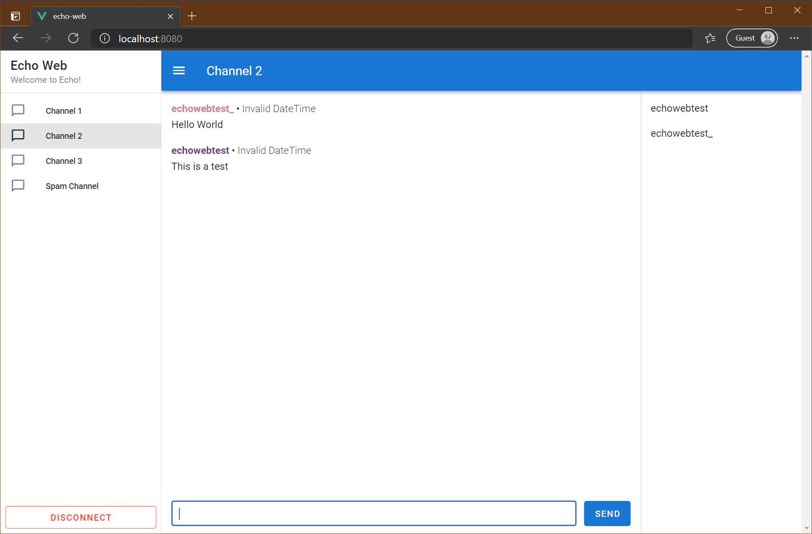

# Echo Web

This is an experimental client for [Echo Server](https://github.com/will-scargill/Echo-Server-V3) which works inside a web browser through WebSockets.



WebSockets must be used because web browsers cannot connect to TCP sockets. So in order to connect to an Echo server, connections need to be tunneled through a WebSocket. This can be done using a tool such as websockify like so:

```bash
docker run --rm -it -p 9000:9000 --entrypoint=/usr/bin/websockify daddyshark/websockify-alpine 9000 ECHO_SERVER_IP:16000 --verbose
```

## Project setup
```
yarn install
```

### Compiles and hot-reloads for development
```
yarn serve
```

### Compiles and minifies for production
```
yarn build
```

### Lints and fixes files
```
yarn lint
```
